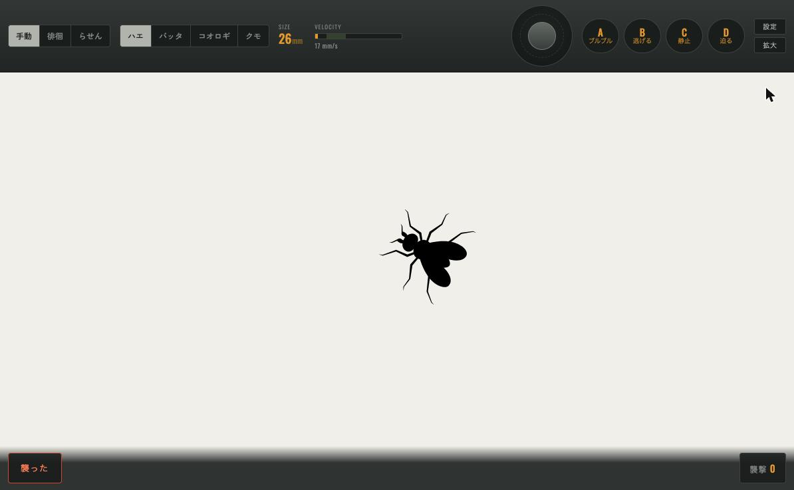
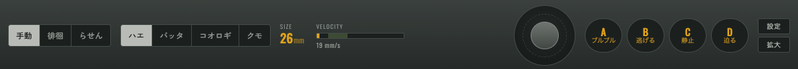
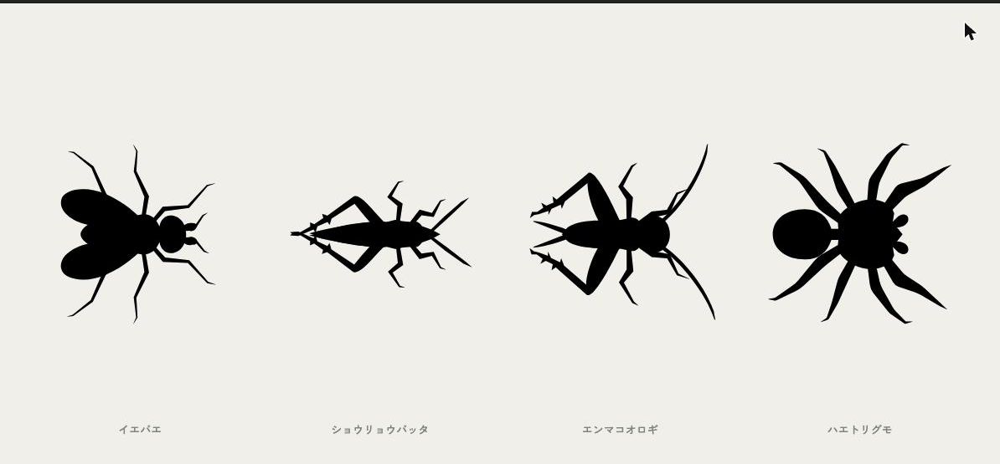
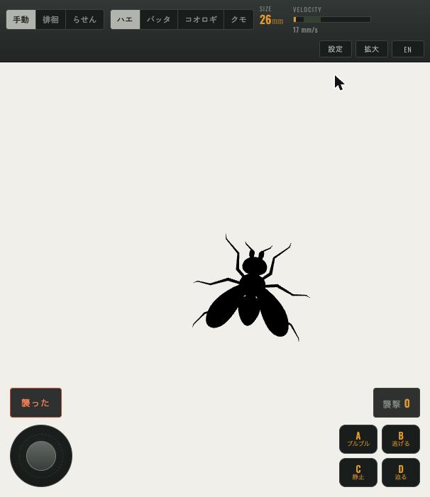
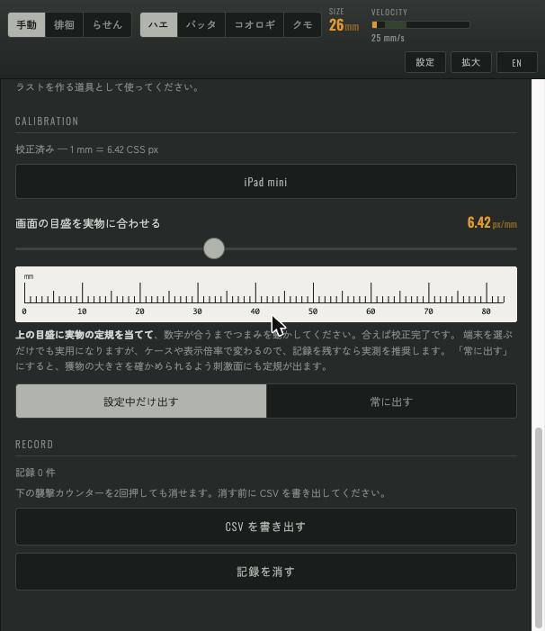

# Mantis Lure

**日本語** / [English](README.en.md)

拾ったカマキリに、画面越しに狩りをさせるための単一ファイル Web アプリ。タブレットを寝かせて置き、
スティックと A/B/C/D ボタンで画面上の獲物を操って、実物のカマキリに襲わせる。獲物の**実寸・速度・
色・コントラスト**をパラメトリックに変えられ、襲撃を記録して CSV に書き出せる。
ビルド不要・依存ゼロで、`index.html` を開くだけ。

**▶ ライブデモ: https://gyroid-eth.github.io/mantis-lure/**

## 設計の芯

1枚の画面に、視覚系のまったく違う観客が2人いる。

カマキリは**明るい無地の場に浮かぶ小さな暗い塊**に反応する。装飾はすべてノイズになる。
飼い主は逆で、装飾がなければ見るものがない。混ぜると両方が濁る。

だから2つを物理的に分けてある。**覗き窓の中には背景と獲物しかない。** 計器もボタンも数値も、
すべて外側の金属の枠に置く。操作卓は**画面の上端**に固定してあるので、遊んでいるあいだ手が刺激面を
横切らない。

## 獲物

| 種 | 動きの癖 |
|---|---|
| イエバエ | 止まらない。ホバー中も翅が羽ばたく |
| ショウリョウバッタ | 大きく跳んで、長く待つ |
| エンマコオロギ | 小刻みに跳ねて、すぐ次へ |
| ハエトリグモ | 走っては固まる。止まると完全に動かない |

シルエットは SVG で、**胴・翅・脚・触角がそれぞれ別のパス**になっていて、各パーツが自分のピボットを
持つ。実行時にパーツを回すので、羽ばたきと脚の運びが速度に追随する。襲撃の引き金は形ではなく動きなので、
1枚の硬いスタンプにはしていない。

## 操作

| 操作 | 動作 |
|---|---|
| スティック | 獲物を動かす。倒した量がそのまま速さになる |
| 画面を直接ドラッグ | 獲物を指の位置へ引き寄せる |
| **A** | ブルブル — その場で震える |
| **B** | 逃げる — 一気に跳ねて離れる |
| **C** | 静止 — 止める |
| **D** | 迫る — 手前に迫るように膨らむ |
| 手動 / 徘徊 / らせん | 行き先を誰が決めるか。あなた / 獲物 / 決まったらせん |
| 襲った | いまの条件で記録を1件残す |

キーボードも使える（矢印キー・space/A・B・C・D）。速度は数値ではなくメーターで出る。緑の帯は報告値が
集まる範囲（45–120 °/s を視距離 10cm で換算したもの）。

**手動 / 徘徊 / らせん は「誰が行き先を決めるか」だけを切り替える。** 種ごとの動きの癖——ハエの微動、
バッタの跳躍、クモの静止——はどのモードでも常に働く。手動では獲物が「居場所」を持ち、それを動かせるのは
あなただけなので、置いた所に留まってその場で暴れる。

## スマートフォン

画面が狭いときは操作系を上端に置けない。とはいえ「手が刺激面を横切らない」という原則は変えたくないので、
**スティックと A/B/C/D を画面の下端に固定**し、上端には選択と計器だけを残す。手に持ったときに親指が
届く位置でもある。言語は右上の **EN / 日本語** で切り替わる（設定は端末に保存される）。

## 校正と、視距離の設定を置かない理由

初期版には「視距離」スライダーがあった。あれは嘘だった。**カマキリがどこにいるかはソフトが決めることでは
なく、歩けば変わる。** だからこのアプリが制御するのは、実際にガラスの上に置けるもの——**長さ(mm)と
速さ(mm/s)**だけにしてある。角度はすべて「視距離◯cm なら」という条件つきの参考値として表示し、
設定画面に距離ごとの換算表（5cm → 29°、10cm → 15°…）を置いた。襲われた距離を測れたときは、その行を読む。

**校正しないと mm は mm にならない。** 画面上の長さは端末の画素密度に依存するからである。設定を開くと
**画面の下端に定規が出る**ので、実物の定規を当てて、目盛が合うまでつまみを動かす。端末プリセットを
選ぶだけでも実用になる。値は端末に保存される。

## 既定値の根拠

| 項目 | 既定値 | 根拠 |
|---|---|---|
| 大きさ | 26 mm（10cm で約 15°）| 種差が大きい。*Sphodromantis lineola* は 10–20° で襲撃率が最大（逆U字）、*Parasphendale affinis* は 9° の円盤でピーク・閾値 6.9°、*Popa spurca* は 44° まで上昇し続ける。[Prete et al. 2013](https://doi.org/10.1242/jeb.089474) |
| 速度 | 140 mm/s（10cm で約 80 °/s）| 報告値は実験の**条件**であって最適値の実測ではない。[Prete et al. 2013](https://doi.org/10.1242/jeb.089474) の 74–180 °/s、[O'Keeffe et al. 2022](https://doi.org/10.1371/journal.pcbi.1009666) のモデル入力 82 °/s |
| コントラスト | 暗い獲物 / 明るい背景 | 3種すべてで、白地に黒い標的が逆より高い襲撃率。[Prete et al. 2013](https://doi.org/10.1242/jeb.089474) |
| 色 | 演出のみ | 色（波長）が輝度と独立に襲撃判断に効くという**行動**データは見つからなかった。受容体の分光感度は既知だが（[Zhu et al. 2025](https://doi.org/10.1007/s00359-025-01776-z)）、それは別の主張 |
| **D**（迫る）| なめらかな拡大 | 輝度エッジの拡大で襲撃率 約60%。サイズ一定で視差だけ動かすと 15–35% に落ちる。[Nityananda et al. 2019](https://doi.org/10.1242/jeb.198614) |

段階的な迫り方（1段 0.85 秒）も選べる。「各段階 0.8 秒以上で最大反応」という報告に当たるためだが、
**その報告は読める一次資料まで辿れなかった**ので既定にしていない。どちらが効くかは自分の個体で試せる。

確認できなかったものも含めた調査の全文は [`docs/RESEARCH.md`](docs/RESEARCH.md)。

## 記録

**襲った** を押すと、その瞬間の設定が1行残る。種・実寸(mm)・10cm 換算の視角・指示速度と実測速度・
獲物と背景の色・Michelson コントラスト・動きのモード・迫り方・校正済みかどうか。
設定 → RECORD → 「CSV を書き出す」で取り出せる。

数えなおすときは**襲撃カウンターを2回押す**。1回目は確認に変わるだけで、4秒で解除される。
**消す前に CSV を書き出すこと。**

## 注意

- **カマキリは画面に飛びかかる。** 保護ガラスを付け、落下しない置き方をすること
- 液晶は人の三色覚に合わせて作られている。UV は無く、リフレッシュレートがカマキリにフリッカーとして
  見えるかは未解決（近縁種の臨界融合周波数は 60Hz をまたぐ）。効くはずの刺激を無視されたら、
  ディスプレイ自体を疑う余地がある
- **餌ではない。** 遊びと観察の道具であって、これで栄養は摂れない

## 開発

すべて `index.html` に入っている（マークアップ・スタイル・ロジック・獲物のパスデータ）。
そのまま開くか、ディレクトリを配信（`python3 -m http.server`）して LAN 経由でタブレットから開く。

## ライセンス

MIT
